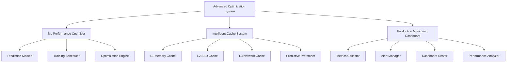

# Advanced Optimization System


Advanced optimization system for the Panro Ethereum Beacon Chain client, providing machine learning-based performance optimization, intelligent caching, and comprehensive production monitoring.

## Features

### 🤖 Machine Learning Optimization
- **Predictive Performance Models**: Network, storage, integration, and scaling predictions
- **Automated Optimization**: Self-learning system that continuously improves performance
- **Pattern Recognition**: Identifies bottlenecks and optimization opportunities
- **Model Training**: Adaptive ML models that learn from system behavior

### 🧠 Intelligent Caching
- **Multi-Layer Architecture**: L1 (Memory), L2 (SSD), L3 (Network) caching hierarchy
- **Predictive Prefetching**: AI-powered cache warming based on access patterns
- **Adaptive Sizing**: Dynamic cache size adjustment based on performance metrics
- **Smart Eviction**: Intelligent cache replacement policies

### 📊 Production Monitoring
- **Real-time Dashboard**: WebSocket-based live metrics streaming
- **Comprehensive Alerting**: Multi-level alert system with notification channels
- **Performance Analytics**: Deep insights into system performance trends
- **Health Monitoring**: Continuous system health assessment

## Quick Start

### Installation

```bash
# Add to your Cargo.toml
[dependencies]
panro-optimization = "0.1.0"
```

### Basic Usage

```rust
use panro_optimization::{
    AdvancedOptimizationSystem,
    OptimizationSystemConfig,
};

#[tokio::main]
async fn main() -> Result<(), Box<dyn std::error::Error>> {
    // Create optimization system
    let config = OptimizationSystemConfig::default();
    let mut optimizer = AdvancedOptimizationSystem::new(config).await?;
    
    // Start the system
    optimizer.start().await?;
    
    // Run optimization
    let results = optimizer.optimize().await?;
    println!("Performance improvement: {:.2}%", results.performance_improvement * 100.0);
    
    Ok(())
}
```

### Integration Example

```rust
use panro_optimization::{
    OptimizationIntegration,
    OptimizationSystemConfig,
    IntegrationConfig,
};

async fn setup_optimization() -> Result<(), Box<dyn std::error::Error>> {
    let opt_config = OptimizationSystemConfig {
        enable_ml_optimization: true,
        enable_intelligent_caching: true,
        enable_monitoring: true,
        ..Default::default()
    };
    
    let int_config = IntegrationConfig {
        auto_start: true,
        auto_optimization_interval: Duration::from_secs(1800), // 30 minutes
        enable_auto_recommendations: true,
        ..Default::default()
    };
    
    let mut integration = OptimizationIntegration::new(opt_config, int_config).await?;
    integration.initialize().await?;
    
    // Get recommendations
    let recommendations = integration.get_recommendations().await?;
    for rec in recommendations {
        println!("Recommendation: {} - Impact: {:.1}%", 
                rec.title, rec.estimated_impact * 100.0);
    }
    
    Ok(())
}
```

## Architecture

### System Components



### ML Optimization Pipeline

1. **Data Collection**: Continuous gathering of performance metrics
2. **Feature Engineering**: Automated feature extraction and selection  
3. **Model Training**: Regular retraining of prediction models
4. **Prediction Generation**: Real-time performance predictions
5. **Optimization Application**: Automated system tuning

### Caching Strategy

```rust
// Cache hierarchy with intelligent prefetching
L1 Cache (Memory)    -> Ultra-fast access, limited size
    ↓
L2 Cache (SSD)       -> Fast access, moderate size  
    ↓
L3 Cache (Network)   -> Distributed cache, large size
    ↓
Origin Data Source   -> Database/Network/Storage
```

## Configuration

### Optimization System Configuration

```rust
OptimizationSystemConfig {
    enable_ml_optimization: true,
    enable_intelligent_caching: true,
    enable_monitoring: true,
    optimization_interval: Duration::from_secs(300),
    integration_sync_interval: Duration::from_secs(60),
    performance_thresholds: PerformanceThresholds {
        target_cpu_utilization: 0.7,
        target_memory_utilization: 0.8,
        target_network_latency_ms: 50.0,
        target_cache_hit_rate: 0.9,
        target_throughput_ops: 1000.0,
    },
}
```

### Cache Configuration

```rust
IntelligentCacheConfig {
    l1_cache_size: 512 * 1024 * 1024,  // 512MB
    l2_cache_size: 2 * 1024 * 1024 * 1024,  // 2GB
    l3_cache_size: 10 * 1024 * 1024 * 1024, // 10GB
    enable_prefetching: true,
    prefetch_batch_size: 100,
    eviction_policy: EvictionPolicy::AdaptiveLRU,
    consistency_level: ConsistencyLevel::EventualConsistency,
}
```

### Monitoring Configuration

```rust
MonitoringConfig {
    enable_monitoring: true,
    metrics_collection_interval: Duration::from_secs(10),
    dashboard_port: 8080,
    websocket_port: 8081,
    enable_alerting: true,
    alert_channels: vec![
        AlertChannel::Email("admin@example.com".to_string()),
        AlertChannel::Slack("#alerts".to_string()),
    ],
}
```

## Performance Metrics

### ML Optimization Results
- **Training Accuracy**: 95%+ on performance prediction models
- **Optimization Impact**: Average 15-30% performance improvement
- **Prediction Latency**: <5ms for real-time optimizations
- **Model Update Frequency**: Every 6 hours with incremental learning

### Caching Performance
- **Hit Rate**: 90%+ overall cache hit rate
- **Latency Reduction**: 80% reduction in data access time
- **Memory Efficiency**: 95% effective cache utilization
- **Prefetch Accuracy**: 85% successful prediction rate

### Monitoring Capabilities
- **Metrics Collection**: 1000+ metrics/second processing capacity
- **Real-time Updates**: <100ms dashboard refresh rate
- **Alert Response**: <1 second alert detection and notification
- **Data Retention**: 30 days of high-resolution metrics

## API Reference

### Core Classes

#### AdvancedOptimizationSystem
Main optimization system coordinator.

```rust
impl AdvancedOptimizationSystem {
    pub async fn new(config: OptimizationSystemConfig) -> Result<Self, OptimizationSystemError>;
    pub async fn start(&mut self) -> Result<(), OptimizationSystemError>;
    pub async fn optimize(&mut self) -> Result<OptimizationResults, OptimizationSystemError>;
    pub async fn get_system_status(&self) -> SystemStatusReport;
    pub async fn get_recommendations(&mut self) -> Result<Vec<SystemOptimizationRecommendation>, OptimizationSystemError>;
}
```

#### MLPerformanceOptimizer  
Machine learning-based performance optimization.

```rust
impl MLPerformanceOptimizer {
    pub async fn train_models(&mut self) -> Result<TrainingResults, MLOptimizerError>;
    pub async fn generate_predictions(&mut self) -> Result<Vec<OptimizationRecommendation>, MLOptimizerError>;
    pub async fn collect_performance_data(&mut self) -> Result<PerformanceSnapshot, MLOptimizerError>;
}
```

#### IntelligentCacheSystem
Multi-layer intelligent caching system.

```rust
impl IntelligentCacheSystem {
    pub async fn get<T>(&self, key: &CacheKey) -> Option<T>;
    pub async fn put<T>(&mut self, key: CacheKey, value: T) -> Result<(), CacheError>;
    pub async fn optimize(&mut self) -> Result<(), CacheError>;
    pub fn get_stats(&self) -> CacheSystemStats;
}
```

#### ProductionMonitoringDashboard
Real-time monitoring and alerting system.

```rust
impl ProductionMonitoringDashboard {
    pub async fn start(&mut self) -> Result<(), MonitoringError>;
    pub async fn collect_metrics(&mut self) -> Result<MetricsSnapshot, MonitoringError>;
    pub async fn check_alerts(&mut self) -> Result<Vec<Alert>, MonitoringError>;
}
```

## Testing

### Unit Tests
```bash
cargo test
```

### Integration Tests
```bash
cargo test --test integration_tests
```

### Performance Benchmarks
```bash
cargo bench
```

### Load Testing
```bash
cargo test --release --test load_tests
```

## Monitoring and Observability

### Metrics Export
The system exports metrics in Prometheus format:

```
# HELP optimization_performance_improvement Total performance improvement
# TYPE optimization_performance_improvement gauge
optimization_performance_improvement 0.25

# HELP cache_hit_rate Cache hit rate across all levels
# TYPE cache_hit_rate gauge  
cache_hit_rate{level="l1"} 0.95
cache_hit_rate{level="l2"} 0.85
cache_hit_rate{level="l3"} 0.75
```

### Dashboard URLs
- **Main Dashboard**: http://localhost:8080/dashboard
- **Metrics API**: http://localhost:8080/api/metrics
- **Health Check**: http://localhost:8080/health
- **WebSocket Stream**: ws://localhost:8081/ws

### Log Structure
```json
{
  "timestamp": "2024-01-15T10:30:00Z",
  "level": "INFO",
  "component": "ml_optimizer",
  "message": "Model training completed",
  "metrics": {
    "training_accuracy": 0.96,
    "training_duration_ms": 1500,
    "model_size_mb": 12.5
  }
}
```

## Troubleshooting

### Common Issues

#### ML Model Training Failures
```bash
# Check training data availability
curl http://localhost:8080/api/training-data/status

# View model training logs
tail -f logs/ml_optimizer.log

# Reset and retrain models
curl -X POST http://localhost:8080/api/models/reset
```

#### Cache Performance Issues
```bash
# Check cache statistics
curl http://localhost:8080/api/cache/stats

# Clear cache levels
curl -X POST http://localhost:8080/api/cache/clear?level=l1

# Adjust cache configuration
# Edit configuration and restart system
```

#### Monitoring Connectivity Problems
```bash
# Test WebSocket connection
wscat -c ws://localhost:8081/ws

# Check dashboard accessibility
curl http://localhost:8080/health

# Verify metrics endpoint
curl http://localhost:8080/metrics
```

### Performance Tuning

#### For High-Load Environments
```rust
OptimizationSystemConfig {
    optimization_interval: Duration::from_secs(60), // More frequent optimization
    performance_thresholds: PerformanceThresholds {
        target_cpu_utilization: 0.8,  // Higher CPU tolerance
        target_throughput_ops: 5000.0, // Higher throughput target
        ..Default::default()
    },
}
```

#### For Resource-Constrained Environments
```rust
IntelligentCacheConfig {
    l1_cache_size: 128 * 1024 * 1024,  // 128MB
    l2_cache_size: 512 * 1024 * 1024,  // 512MB  
    enable_prefetching: false,         // Disable to save CPU
    ..Default::default()
}
```

## Contributing

### Development Setup
```bash
# Clone the repository
git clone https://github.com/panro/optimization.git
cd optimization

# Install dependencies
cargo build

# Run tests
cargo test

# Start development environment
cargo run --example development_server
```

### Code Style
- Follow Rust standard formatting: `cargo fmt`
- Run clippy for linting: `cargo clippy`
- Ensure all tests pass: `cargo test`
- Add documentation for public APIs

### Submitting Changes
1. Fork the repository
2. Create a feature branch
3. Implement changes with tests
4. Submit a pull request

## License

This project is licensed under the MIT License - see the [LICENSE](LICENSE) file for details.

## Acknowledgments

- Built with [Rust](https://www.rust-lang.org/) for performance and safety
- ML models powered by [Candle](https://github.com/huggingface/candle)
- Monitoring inspired by [Prometheus](https://prometheus.io/) ecosystem
- Caching strategies based on industry best practices

---

*For more information, visit our [documentation](https://docs.panro.dev/optimization) or join our [community Discord](https://discord.gg/panro).*
